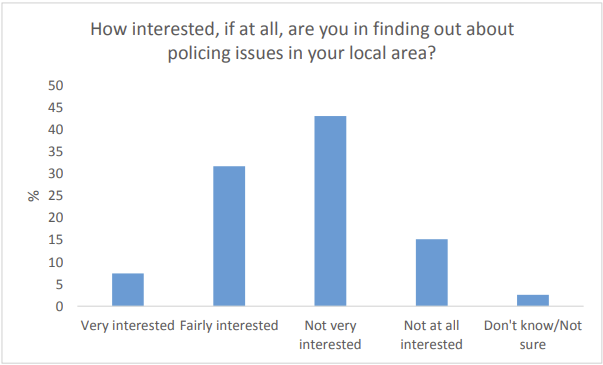
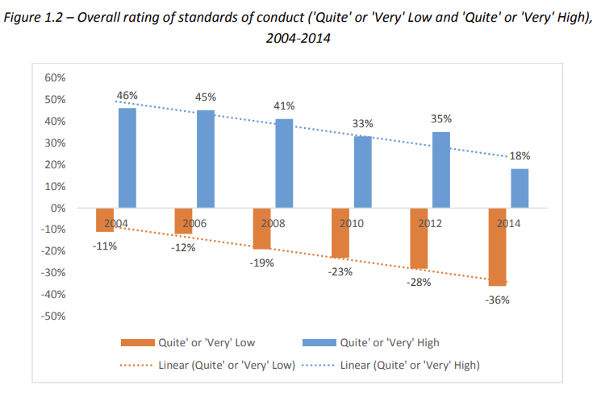

Towards the end of my graduate studies I did some work for the <a href="https://www.gov.uk/government/organisations/the-committee-on-standards-in-public-life/about" target="_blank"><em>Committee on Standards in Public Life</em></a>  (CSPL), the public body set up to advise the Prime Minister about of the ethical standards across public life, helping them analyze two surveys.

The first survey looked at public awareness of police accountability (elected Police and Crime Commissioners -- PCCs -- had been introduced a few years earlier). The short version is that while the majority of people survyed trusted the police and had heard of PCCs, they knew very little about how PCCs worked and what they did, and were not particularly interested in policing matters. You can read the report I wrote  <a href="https://assets.publishing.service.gov.uk/government/uploads/system/uploads/attachment_data/file/439221/Public_Awareness_of_Police_Accountability_report_final_draft.pdf" target="_blank">here</a>.

The second survey examined public attitudes toward standards of conduct in public life, building on a series of earlier surveys that had run biennially since 2004. In general people were pretty pessemistic about standards of conduct and these perceptions had got worse over time. You can read the report I wrote <a href="https://assets.publishing.service.gov.uk/media/5a80c63740f0b62305b8d133/Survey_of_public_attitudes_towards_conduct_in_public_life_2014_final_19_march.pdf" target="_blank">here</a>. 

