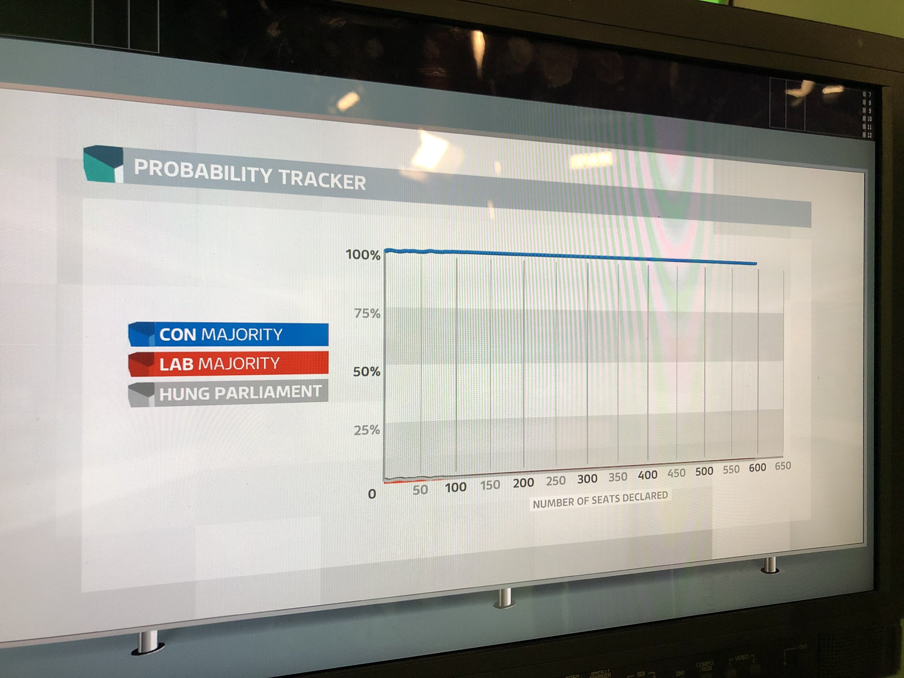

Since 2015 I have worked as a data analyst (what people in the media call a &#8216;<a href="https://en.wikipedia.org/wiki/Psephology">psephologist</a>&#8217;) for the ITV News overnight election results programme. 

Since the 2016 EU referendum I have run ITV's result projection model, which tries to work out what the final outcome is going to be before all the results have come in. This happened slightly by accident. One of the challenges of covering the 2016 referendum was that, unlike a general election, we couldn't compare the results to what had happened a few years previously. To help ITV's on screen experts Professors Jane Green and Colin Rallings make sense of the results as they came in, I estimated a <a href="https://www.britishpollingcouncil.org/briefing-spotlight-on-mrp/">MRP forecast</a> of the referendum outcome. Jane and Colin could then compare the results to my forecast and say whether the results were looking good for Leave or Remain. As the results came in, I could also adjust the model and estimate the probability of Leave or Remain winning the referendum. 

This was originally intended just to be something in the background that helped inform Jane and Colin's analysis on screen, but during one of our rehearsals, Colin casually mentioned that the model said there was an x% chance Leave had won our rehearsal scenario. The fact that we could say things like this got the programme editors quite excited, and a few hastly assembled graphics later, my probabilties were a key part of ITV's coverage. Based on my forecast, ITV became the first major media organisation in the world to announce that Britain had voted to leave the EU.    

In 2017 I developed a similar model to predict the result of the 2017 General Election, which I further refined and used again to predict the results in 2019 and 2024. The main role of these models in the ITV programme is to estimate how many seats each party will win at the end of the night. Like my referendum model, the election models also calculate probabilities of different final outcomes, but -- thanks to the accuracy of the exit poll -- these haven't featured much in the programme because they haven't tended to change much over the course of the night...

Since 2019 I have also been part of the team that produces the joint ITV-BBC-Sky exit poll, which gives the world the first indication of the likely outcome of the election.

 
  
  
  
  