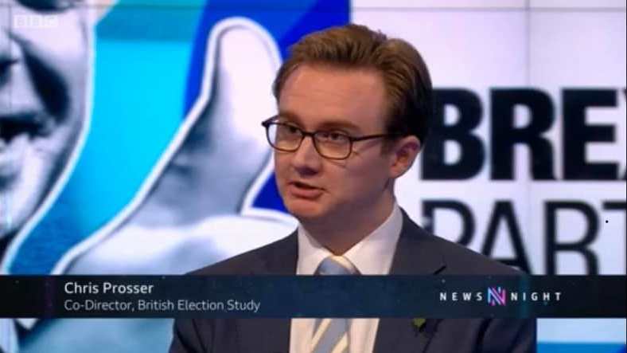

As well as my work with [ITV](/other/itv/), I give regular interviews to the national and international media, generally talking about something to do with British elections or polling. I've appeared on flagship programmes such as *Newsnight* and *Today*, and I've been interviewed by most of the major British newspapers, including the *Guardian*, *Times*, *Telegraph*, and *Economist*. 

I particularly enjoy doing podcasts, because they give me the opportunity to talk about things in more depth, and I've appeared on podcasts such as Sky News's *All Out Politics*, the *Guardian Politics Weekly*, and the Times's *Red Box Politics*. 

One podcast that might still be of interest to people despite the passage of time is <a href="https://shows.acast.com/timesredbox/episodes/electionshocktherapy" target="_blank">an episode of the <em>Red Box Politics</em> podcast</a> in which my BES colleagues Jane Green, Geoff Evans and I talk about our book *Electoral Shocks*.

If you're a journalist of podcaster who would like to talk to me, please [get in touch](/contact/).