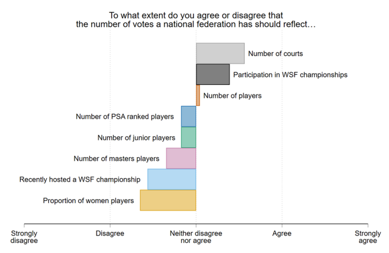

In 2018-19 I was part of the World Squash Federation's (WSF) Voting Structure and Representation Review Group, which was tasked with examinnig the voting system the WSF uses to make decisions at the general meetings.[^1] 

Voting rules in international sporting bodies such as the WSF raise interesting questions about equality and representation -- different countries have wildly varying levels of participation in squash, and there are large differences in the resources that national squash federations can wield. Should each country have equal voting rights, or should places with more squash players have more say in what the WSF does? If you give some countries more votes than others, how many more do they get, and what measure do you use decide how many votes each country gets? 

My main role in the Review Group was designing and analysing a survey of national squash federations to find out what *they* thought about these questions. You can read the report we produced  <a href="https://www.worldsquash.org/wp-content/uploads/2019/08/190530_WSF-Voting-Structure-Representation-Report-Final.pdf" target="_blank">here</a>. My analysis of the survey starts on slide 21.

[^1]: I know lots of about elections and voting, but I don't actually play squash. I ended up doing this the way that lots of things happen to early career academics -- the WSF asked someone more senior who didn't have time to do it, and they suggested asking me instead. 