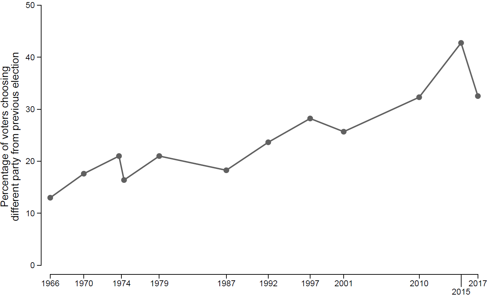
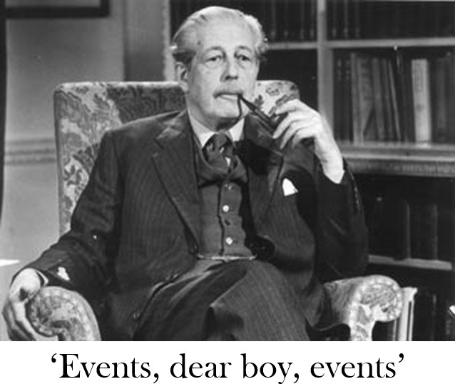

The British Election Study (BES) is a long-running academic survey research project funded by the Economic and Social Research Council (ESRC). We track public opinion and voting behaviour in British elections and try to explain changes in party support and electoral alignments. The first surveys in what would become the BES were fielded in the run up to the 1964 General Election by Sir David Butler and Donald Stokes, and a BES survey has been conducted around every general election ever since. You can read more about the BES and get access to all of our data on the <a href="https://www.britishelectionstudy.com/" target="_blank">BES website</a>.

I joined the BES as a post-doc shortly before the 2015 General Election, and since 2019 I have been co-director of the project. The period I have worked on the BES has been one of the most tumultuous in British electoral history, and tying to make sense this turmoil has been the central preoccupation of my research for the past decade. My BES colleagues and I put forward our framework for understanding recent elections in our book, *Electoral Shocks*.

Our explanation has two parts. First, as traditional partisan loyalties have waned, British voters have become more volatile -- increasingly likely to switch parties between elections.

But the rise of volatile voters only tells you part of the story -- voters might be more likely to switch parties *in general*, but you need to know more to explain why they switch from one party to another. The second part of our explanation is that voter loyalties can be disrupted by 'electoral shocks' -- significant and often unanticipated events that change which issues are on the political agenda and disrupt voters' perceptions of what the parties stand for and their ability to govern competently.

In *Electoral Shocks*, we look at five shocks -- immigration, the Global Financial Crisis, the Conservative-Liberal Democrat coalition, the 2014 Scottish Independence referendum, and the 2016 Brexit referendum. You can read a free copy of *Electoral Shocks* online <a href="https://doi.org/10.1093/oso/9780198800583.001.0001" target="_blank">here</a>. We also wrote a follow-up paper looking at how these shocks affected the 2019 General Election, which you can read <a href="https://doi.org/10.1017/S1049096523000422" target="_blank">here</a>.

Our second book, *Electoral Realignment*, extends our analysis and looks in particular at the way one of these shocks -- Brexit -- has led to a realignment in British voting behaviour, a realignment which has persisted despite the waning of Brexit as an electoral issue. We also make the case for the continuity of the Brexit realignment at the 2024 election in a paper published <a href="https://doi.org/10.1093/pa/gsaf016" target="_blank">here</a>.

With some or all of my BES colleagues, I have also written many other papers looking at specific issues in recent British elections, such as the <a href="https://doi.org/10.1016/j.electstud.2018.01.002" target="_blank"> the impact of the Scottish independence referendum </a> on voting in Scotland, the role of <a href="https://doi.org/10.1093/pa/gsy001" target="_blank"> Brexit and Jeremy Corbyn</a> in vote switching at the 2017 General Election, <a href="https://doi.org/10.1016/j.electstud.2020.102129" target="_blank"> age and electoral turnout, </a> and the relationship between <a href="https://doi.org/10.1093/pa/gsab030" target="_blank"> political values and attitudes related to covid-mitgation policies </a>.

If you're interested in my interpretation of particular elections, I have also written a series of articles for the academic journal *West European Politics* looking at the <a href="https://doi.org/10.1080/01402382.2016.1173335" target="_blank">2015</a>, <a href="https://doi.org/10.1080/01402382.2018.1424838" target="_blank">2017</a>, <a href="https://doi.org/10.1080/01402382.2020.1773640" target="_blank">2019</a>, and <a href="https://doi.org/10.1080/01402382.2024.2430915" target="_blank">2024</a> general elections.
