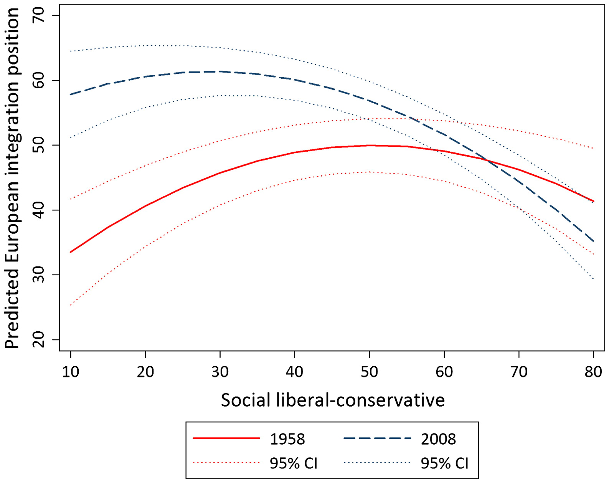
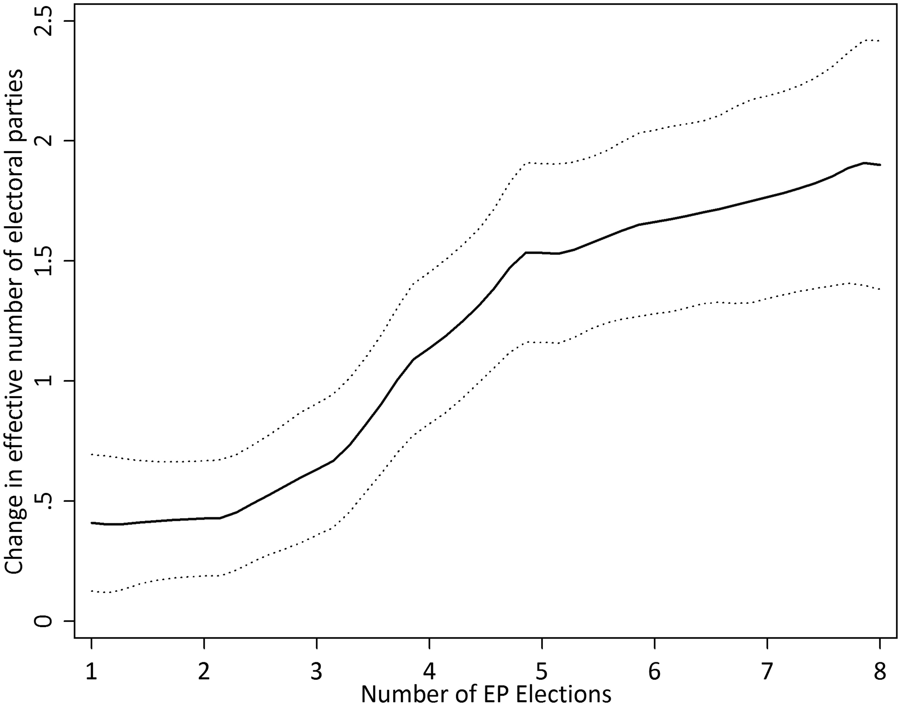

Before I joined the British Election Study, I started my academic life as a comparativist. My graduate research looked at the comparative electoral politics of European integration. Most of this research ended up being published in a series of journal articles.[^1]

[^1]: I also did some work on assimilation and contrast bias and EU issue voting that I never got round to publishing. If you really want to read that you'll have to dig my thesis out of the Bodleian.

My first paper about the politics of European integration, which was a condensed version of my master's thesis, looked at the reasons EU member states call referendums on the EU.[^2] I argue that they do so primarily as a result of domestic political pressure arising from three sources: electoral pressure when the EU is unpopular and elections are close, rules governing the use of referendums, and domestic institutional veto players. I argue in the paper that this helps explain why referendums on the EU frequently fail -- they are often held precisely because of the circumstances that make it difficult to rally support in favour of European integration.[^3] You can read the paper <a href="https://doi.org/10.1111/1467-9248.12176" target="_blank">here</a>.

[^2]: Pedantic note to other scholars of these things: <a href="https://www.cambridge.org/core/journals/ps-political-science-and-politics/article/referendum-conundrum-referenda-or-referendums/FF2D4AAE426D7FCB68FE0056A1D4C78E" target="_blank">referend<em>ums</em> not referend<em>a</em></a>

[^3]: I just want to point out that I wrote this several years *before* the 2016 Brexit referenudum.

My next paper looked at the relationship between party ideology and positions towards European integration. I argue that in order to understand the evolution of party positions towards the EU we need to think about party ideology in a two-dimensional 'economic left‒right/social liberal-conservative' way rather than a one-dimensional 'general left‒right' way. We also need to think about the relationship between party ideology and positions towards the EU as a dynamic rather than static process. When we do both of these things, we can see that divisions over social issues have replaced economic concerns as the main driver of party attitudes towards European integration. You can read the paper <a href="https://doi.org/10.1080/01402382.2015.1116199" target="_blank">here</a>.

My third paper looked at the impact of European Parliament electoral systems on party system size at the European Parliament and national election level. I argue that where European Parliament elections use electoral systems with a larger district magnitude than national elections (which is the case in most countries), the size of the party system at European Parliament elections will grow over time to what you would expect from the more permissive electoral system. This larger party system will also have spillover effects on national party systems -- fragmentation at one level leads to fragmentation in the other. You can read the paper <a href="https://doi.org/10.1177/1465116516633300" target="_blank">here</a>.

Since I joined the BES, I have focused on Britain rather than comparative research, but -- thanks to Brexit -- I still spend a lot of my time thinking about the role of European integration in electoral politics.
