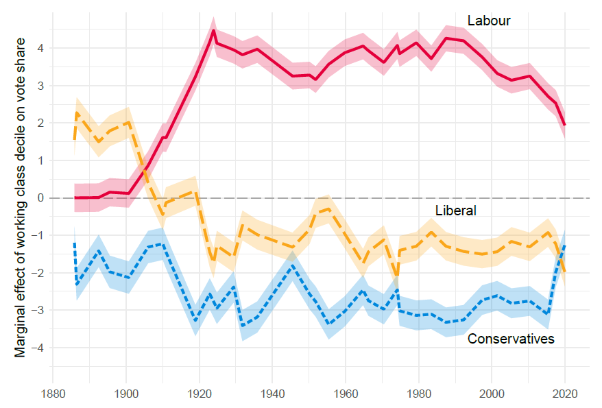
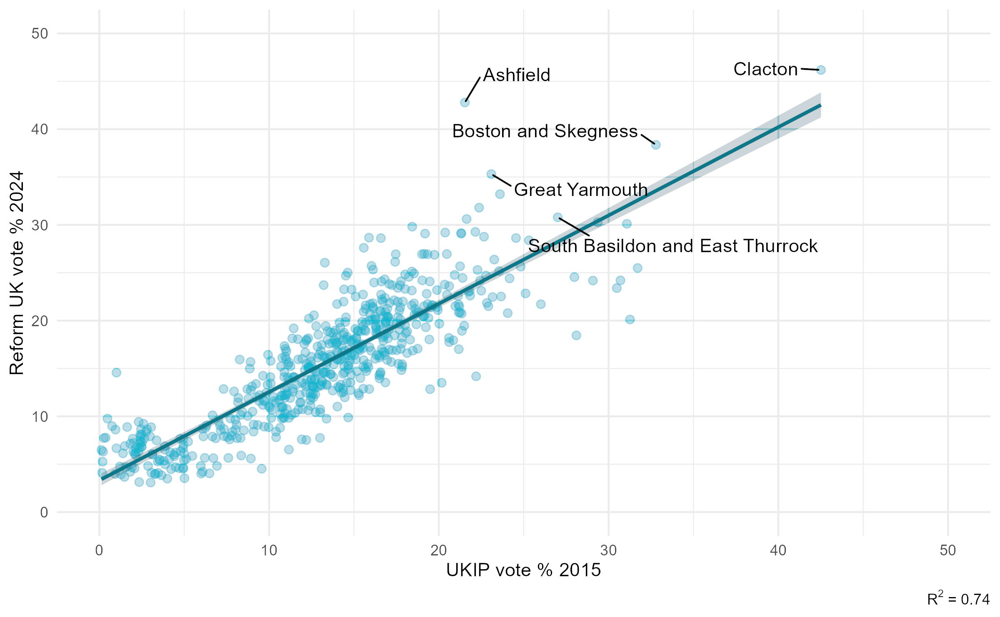

A few years ago, my Royal Holloway colleague Olli Heath and I started working with two historical geographers, Humphrey Southall and Paula Aucott (who run the <a href="https://www.visionofbritain.org.uk/" target="_blank">vision of Britain through time</a> website), on a project linking historical census data and election results from the mid-19th century to the present day. In 2024 we were awarded a grant by the Economic and Social Research Council (ESRC) to facilitate this work.

The first paper we've worked on looks at a long running question of interest in British election studies -- the relationship between social class and voting. We find that there is a clear relationship between class and voting before both the mass enfranchisement of 1918 and the emergence of Labour as a political party at the start of the 20th century -- in the late 19th century, working class areas were more Liberal supporting and middle class areas were more Conservative supporting. The early 20th century was a period of rapid change -- even before the split of the Liberal party in the First World War, the class-Liberal relationship was collapsing and Labour was establishing itself the party of the working class. In the mid-1920s, the class-vote relationship becomes firmly established and remains remarkably stable for nearly eight decades, before starting to wane in the 1990s. At the moment, we're updating the paper to include data from the 2024 General Election, but if you'd like to read the previous version, please get in touch.

Our second paper uses a set of redistricted election results that puts the 1997-2024 elections onto a common set of constituency boundaries. This allows us to compare elections across boundary changes, and in the paper we use the data to look at the rise of Reform UK at the 2024 election. You can read the paper <a href="https://doi.org/10.1111/1467-923X.13484" target="_blank">here</a>.

This project is still at a relatively early stage -- we're planing on exploring the relationship between voting other demographic variables such as age, religion, and education, and redistricting earlier elections onto the same boundaries as well. Stay tuned!