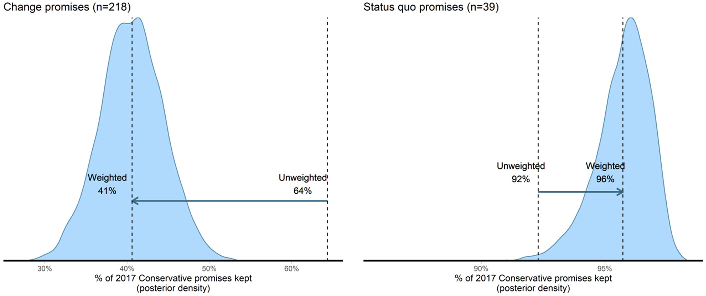

As well as my main research projects, sometimes I find myself working on other things unrelated, or only tangentially related, to the other things I do.

One project of this sort was my paper with Jon Mellon about the non-representativeness of social media users, who on average are younger and better educated than non-users, and tend to be more liberal and pay more attention to politics, which you can read <a href="https://doi.org/10.1177/2053168017720008" target="_blank"> here</a>.[^1]

[^1]: Amusingly, given that we wrote this paper in about a week and it has little do with most of my other research, this is actually my most cited paper. Many of these citations appear to be some sort of ritualistic incantation, whereby scholars invoke a paper pointing out problems with the data they're using in the hope that those problems don't affect the conclusions they want to draw.

Another side-project was a paper with Jon Mellon, Jordan Urban, and Adam Feldman, which came up with a method of weighting different manifesto pledges using a conjoint survey. There is a large literature that looks at how good political parties are at keeping their manifesto promises when they are in government. As we discuss in the paper, a problem with this literature is that it tends to treat all promises equally, but clearly a promise to leave the EU, for example, is something different to a promise to keep supporting the Welsh-language TV channel S4C.[^2] We argue that one way of assessing the importance of different promises is to ask voters. We show that when we take these importance ratings into account, we reach very different conclusions about how good governments are at keeping their promises. You can read the paper <a href="https://doi.org/10.1177/00323217211027419" target="_blank"> here</a>.

[^2]: I have nothing against S4C -- our respondents saw these as the most and least central promises in the Conservatives 2017 election manifesto.

