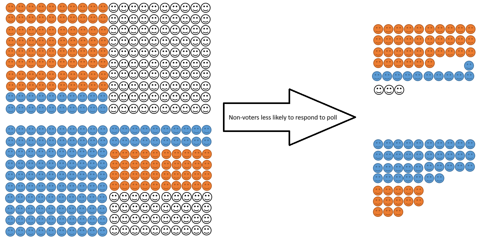

As well as designing and fielding a large number of surveys as part of the BES, I am interested in the use of surveys as a research tool more generally, in particular what drives polling error and how we can make surveys more accurate.

My first paper on this topic was an investigation into the 2015 UK polling miss with my BES colleague Jon Mellon. The 2015 polls put the Conservatives and Labour neck-and-neck, but the result, when it came, was a decisive victory for the Conservatives. Jon and I were the first to point the finger at problems to do with the representativeness of polling samples -- a conclusion later echoed by the British Polling Council's inquiry into the polling miss. The problem, Jon and I argue, was not that samples were biased in favour of one party per se, but rather they over-sampled people who were politically engaged.

Political engagement and party choice are demographically correlated -- for example, younger people are less likely to turn out to vote but more likely to vote Labour when they do. If non-voting young people don't answer polls they will be substituted with young people who do. Failing to take this into account and weighting, or quota sampling, using population demographic targets leads to an inflation in support for parties supported by voters who are demographically similar to those who are politically disengaged. You can read the full paper <a href="https://doi.org/10.1093/poq/nfx015" target="_blank">here</a>.[^1] We also submitted our findings as written evidence to the *House of Lords Select Committee On Polling and Digital Media*, which you can read <a href="http://data.parliament.uk/writtenevidence/committeeevidence.svc/evidencedocument/political-polling-and-digital-media-committee/political-polling-and-digital-media/written/69451.pdf" target="_blank">here</a>.
  
[^1]: We also started work on a paper showing you can counteract this problem by weighting to overall levels of turnout -- a method employed successfully by the pollster Kantar in 2017. We never got around to polishing the paper up for publication, but you can read the rough draft <a href="https://papers.ssrn.com/sol3/papers.cfm?abstract_id=2720206" target="_blank">here</a>.

Jon and I also wrote a review paper that surveys the literature on the causes of polling error, which you can read <a href="https://doi.org/10.1017/gov.2018.7" target="_blank">here</a>, and Ed Fieldhouse and I wrote a chapter about using non-probability internet surveys for the *The Routledge Handbook of Public Opinion and Voting Behaviour*, which you can find <a href="https://www.routledge.com/The-Routledge-Handbook-of-Elections-Voting-Behavior-and-Public-Opinion/Fisher-Fieldhouse-Franklin-Gibson-Cantijoch-Wlezien/p/book/9780367500115?srsltid=AfmBOorYSlDgR1Uopn2aRTr-rL0Sz1E4dHym16KgxWjY8ChVb0c_EXC_" target="_blank">here</a>.

More recently, I have just started work on a paper looking at whether polls are biased towards particular types of political parties, in collaboration with Jon Mellon, Stuart Perrett, Will Jennings, and Chris Wlezien. This project is still in the very early stages, so I can't tell you what we find yet. Once that paper is ready, we are also hoping to test Jon and my theory about missing non-voters comparatively. 

