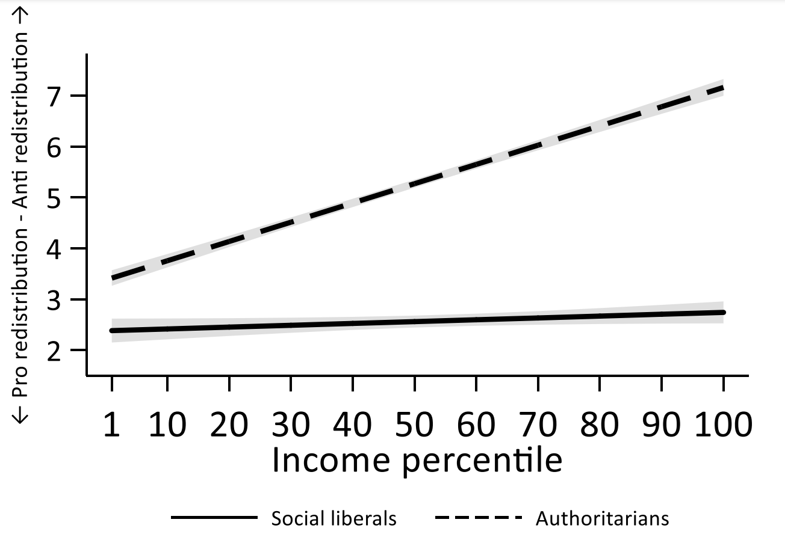
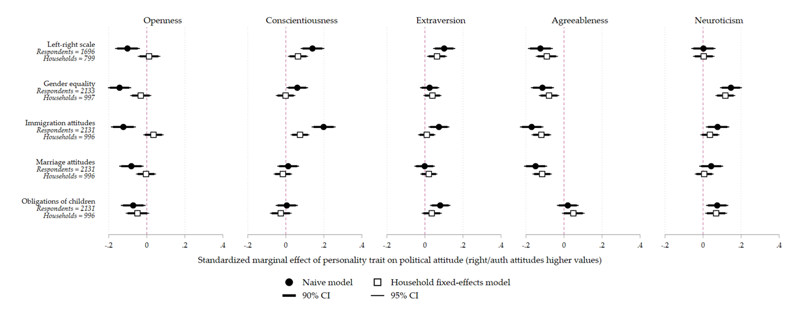

As someone who studied psychology as an undergrad, psychological approaches to understanding political behaviour underpin much of my wider work -- in *Electoral Shocks*, for example, we look at the way in which the two sides of the EU referendum crystalised into Remain and Leave social identities. But I have also carried out research that is more explicitly concerned with political psychology.

In one project, together with Jon Mellon, I look at the relationship between authoritarian disposition and attitudes towards redistributive policy preferences. Previous scholarship has argued that authoritarianism and economic policy preferences are unrelated, and indeed they appear to be largely uncorrelated. We argue, however, that this lack of correlation appears because authoritarianism has different effects depending on where you sit on the socio-economic spectrum. Authoritarians -- as the standard account says -- don't like threats. If you are a rich authoritarian, redistribution is threatening. If you are a poor authoritarian, the *lack* of redistribution is threatening.

Unfortunately, because of two early elections, the pandemic, and the arrival of several babies, this paper is languishing in whatever the academic equivalent of <a href="https://en.wikipedia.org/wiki/Development_hell" target="_blank">development hell</a> is. Hopefully we'll get around to finishing it properly before too long, but in the meantime, you can read an early draft <a href="https://papers.ssrn.com/sol3/papers.cfm?abstract_id=3022169" target="_blank">here</a>.

A second project, with Jon Mellon and Jack Bailey -- also sadly stuck in development hell -- reconsiders the relationship between personality (as measured by the 'big five') and political attitudes. A great deal of previous research has shown that people who are higher on openness tend to be more politically liberal, while those higher on conscientiousness tend to be more conservative. We suggest that this relationship is potentially spurious and driven by omitted contextual confounding variables. If we compare people who share those omitted confounders (i.e. those who live in the same household), we no longer see the same correlations between personality and political attitudes.

We've presented our findings at a few conferences, but there isn't a draft floating around on the internet. If you'd like to have a look what we've written up so far, please drop me an email.

If I ever manage to finish these papers, I also have some ideas I'd like to write up relating to party unity and partisan identification, and the role of descriptive norms in vote choice. Hopefully they'll see the light of day eventually.
