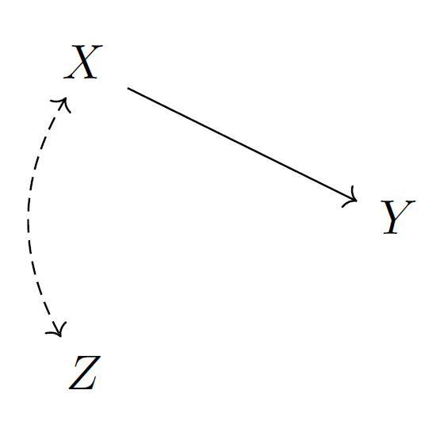
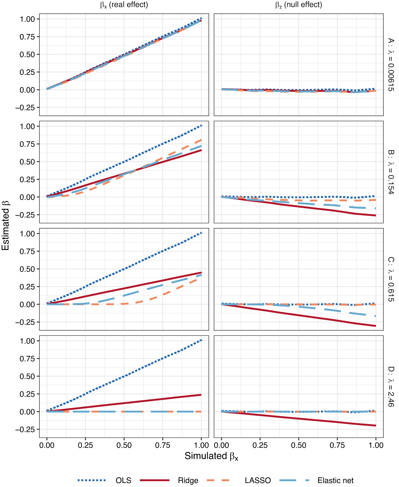

I am something of an accidental methodologist -- I am generally more interested in substantive questions than research methods per se. Sometimes in the course of trying to answer those questions I end up delving into methodological issues. Perhaps because of this, a lot of my methodological research lives, slightly unloved, in the appendices of various other papers. For example, in the appendix to my paper about<a href="https://ars.els-cdn.com/content/image/1-s2.0-S0261379420300159-mmc1.pdf" target="_blank"> age and turnout</a> I show that weighting to aggregate population targets (e.g. overall levels of turnout) also improves subgroup estimates of that outcome. And in the appendix to my paper about<a href="https://journals.sagepub.com/doi/10.1177/00323217211027419#supplementary-materials" target="_blank"> promissory representation</a>, Jon and I came up with a novel method for analysing conjoint experiments using Bayesian multiple membership multiple classification (MMMC) models, which we further complicate by adding a finite mixture component.

My most explicitly methodological paper examines the impact of statistical regularization (e.g. ridge regression, LASSO etc) on statistical adjustment for confounders. Imagine you had a causal process that looks liked this: *X* has a causal effect on *Y*, *X* and *Z* are correlated, but *Z* has no causal effect on *Y*.

If you were to estimate a regression model: `y ~ z` You would spuriously find an association between *Y* and *Z* -- in the language of causal graphs, there is a backdoor path between *Y* and *Z --* but you can block this backdoor path by estimating a model adjusting for *X*: `y ~ x + z`

If you add some sort of statistical regularization to this model, e.g. by using ridge regression, this will shrink the coefficient for *X* -- *shrinking* coefficients is what we generally understand regularization as doing. However, the consequence of shrinking the *X* coefficient is that were will be residual variance in *Y* that is still correlated with *X*, and because it is correlated with *X* it will be correlated with *Z*. This residual variance can be accounted for by increasing the coefficient for *Z*, and so rather than regularization shrinking the *Z* coefficient, it can actually *inflate* it. Having closed the backdoor path by covariate adjustment, regularization reopens it. You can read the full paper <a href="https://doi.org/10.1017/S0003055424000935" target="_blank">here</a>.

More generally, I am interested in Bayesian statistics, using causal graphs (directed acyclic graphs -- DAGs) to think about how we can make causal inferences, statistical measurement, and using simulations to understand statistical processes. One day -- if I ever find the time -- I'll write a paper about why you shouldn't control for age, period, and cohort varying demographic variables in age-period-cohort models. I'd also like to work on a bigger project about the impact of measurement error on causal inferences.
