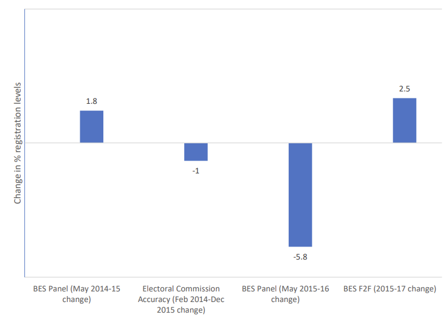
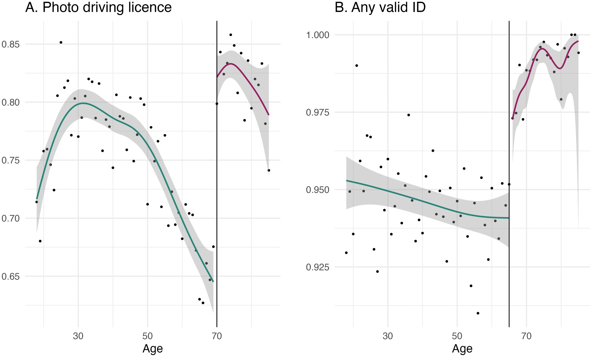

From 2015-19 I worked on a sub-project of the British Election Study in collaboration with the *Electoral Commission* that looked at the impact the introduction of Individual Electoral Registration (IER) had on voter registration in Great Britain. In the run-up to IER there was a lot of concern that many people would be knocked off the electoral register -- particularly young people, non-English speakers, and those who live in institutional settings such as student halls. Our research shows that whether that happened depends on when we are talking about. If we look registration *at the time of a general election* then there is little evidence to suggest IER had a negative impact on registered. However, *between* elections quite a few people -- particularly those who move houses -- do drop off the electoral register. These contradictory patterns can be reconciled by the fact that those who drop off the register between elections often remember to register themselves again when an election is called.[^1]

[^1]: This pattern helps to explain why the surge in electoral registration in the run-up to the 2017 and 2019 elections, which some people heralded as a new dawn of democratic renewal, failed to translate into concomitant increases in electoral turnout.

Although this is mostly good news for democracy -- IER doesn't seem to have had disparate impact on political participation -- the full story is more complicated. Electoral registers are not just used to determine who is allowed to cast a vote on election day, they are also used to draw electoral boundaries. If boundaries are redistricted using a non-election year set of registers, the registers will give a misleading picture of how many electors each constituency will contain on election day -- places with lots of people who have fallen off the register will be underrepresented in the next parliament relative to places with relatively stable registers.

We wrote up these findings in a report for the *Electoral Commission*, which you can read <a href="https://www.britishelectionstudy.com/wp-content/uploads/2021/02/Registration-Report-BES-website.pdf" target="_blank">here</a>.[^2] We also gave written and oral evidence to the *House of Lords Select Committee on The Electoral Registration and Administration ACT 2013*, which you can read <a href="https://committees.parliament.uk/writtenevidence/186/pdf/" target="_blank">here</a>.

[^2]: We were planning on turning this into an academic journal article as well, but thanks to the early 2019 election, the pandemic, and the arrival of small children that didn't happen.

While we were getting to grips with electoral registration we came to the realisation that electoral turnout, as it is commonly reported in the UK, is a misleading measure of electoral participation. The standard way of measuring turnout at both the national and constituency level is divide the number of voters by the number of entries on the electoral register. But the electoral register is neither a *complete* (some people are unregistered) nor *accurate* (some people appear more than once) record of who is eligible to vote in the UK. In order to calculate turnout accurately you need to know how many people are actually eligible to vote, whether or not they are registered. Unfortunately, there is no record of how many people are eligible to vote, so we set about trying to estimate it. You can read a draft of our efforts <a href="https://papers.ssrn.com/sol3/papers.cfm?abstract_id=3773695" target="_blank">here</a>.[^3]

[^3]: Getting this paper finished also fell victim to the early 2019 election, the pandemic, and the arrival of small children, though I still live in hope we might actually finish this one eventually.

More recently, we've been working on the impact of the introduction of voter identification requirements in Great Britain. We find that around 5% of the voting-age population lack valid id, and that younger, less educated, and poorer people are more likely to lack ID. A small but significant proportion of registered voters (between 1.2% and 2.4%) reported either being turned away or dissuaded from voting because they didn't have an ID. We also find that Conservative voters are more likely have valid IDs. You can read the paper <a href="https://doi.org/10.1093/pa/gsae039" target="_blank">here</a>. 

